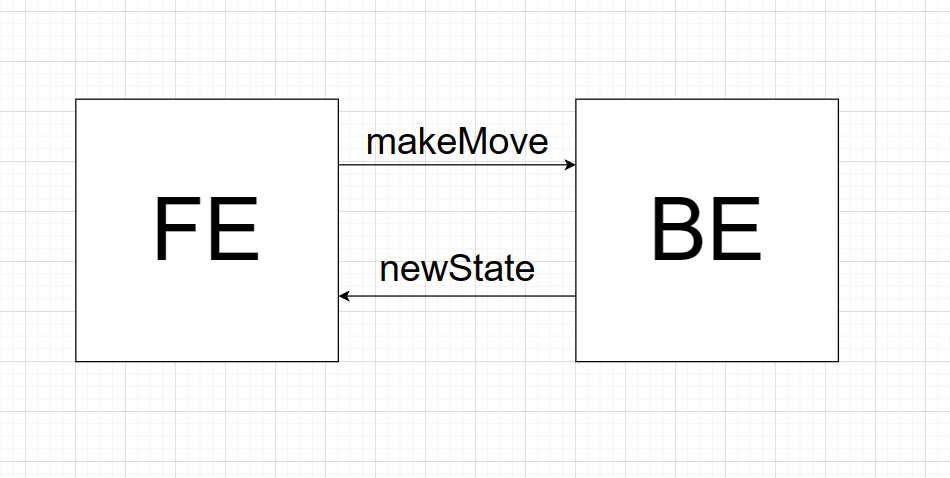
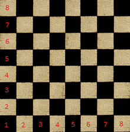

# Chess game

## Frontend

## Backend



## Requests structure

### Backend expected request 

```
{ 
    x: number,
    y: number
}

```
The URL for the requests is `/api/v1/movePiece/{x}/{y}` where X and Y are the current positions of the piece.
### Backend response

```
{
    PieceID: number,
    FirstPiece: { 
        x: number,
        y: number
    }
    PieceID: number,
    SecondPiece: {
        x: number,
        y: number
    }
}
```

The logic for the backend request-response is that whenever you need to move a piece you should specify the piece, the current position of the piece, and the desired new location.

What you get in response is either 1 or 2 pieceses new info. This is because everytime you make a move a maximum of 2 pieces are affected. If the move is simply taking one piece from one space to another, then the response will only contain the data for 1 piece. If the piece captures another piece for example there will be 2 infos given back, one for each piece 

## Board notation


The board has 2 dimensions: X horizontally and Y vertically. Each of these has a value between 1 and 8.